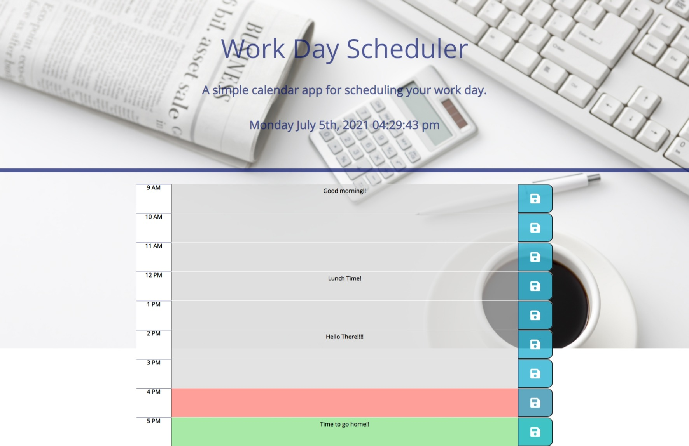

# Workday Planner

# Description:

Description of project: Create a simple calendar application that allows a user to save events for each hour of the day by modifying starter code. This app will run in the browser and feature dynamically updated HTML and CSS powered by jQuery.

## Completed Tasks

* The current day is displayed at the top of the calendar.

* When you scroll down there are timeblocks for standard business hours.

* Each timeblock is color coded to indicate whether it is in the past, present, or future.

* When you click into a timeblock you can enter an event.

* When you click the save button for that timeblock the text for that event is saved in local storage.

* When the page is refreshed the saved events will persist on the screen.

# Screenshot

# Link to Deployed Project

[Workday Planner](https://matthewvandevort.github.io/Work-Day-Scheduler/)

# Resources Used

* [Set Interval MDN](https://developer.mozilla.org/en-US/docs/Web/API/WindowOrWorkerGlobalScope/setInterval)

* [Event Listeners MDN](https://developer.mozilla.org/en-US/docs/web/api/eventlistener)

* [Bootstrap Docs](https://getbootstrap.com/docs/4.1/getting-started/introduction/)

* [Moment Docs](https://momentjs.com/docs/)

* [jQuery Docs](https://api.jquery.com/)

* [YouTube](https://www.youtube.com/)

# Sources

* Thanks to my Instructor Dan Gross and TA's Anrdrew H. and Ross K.